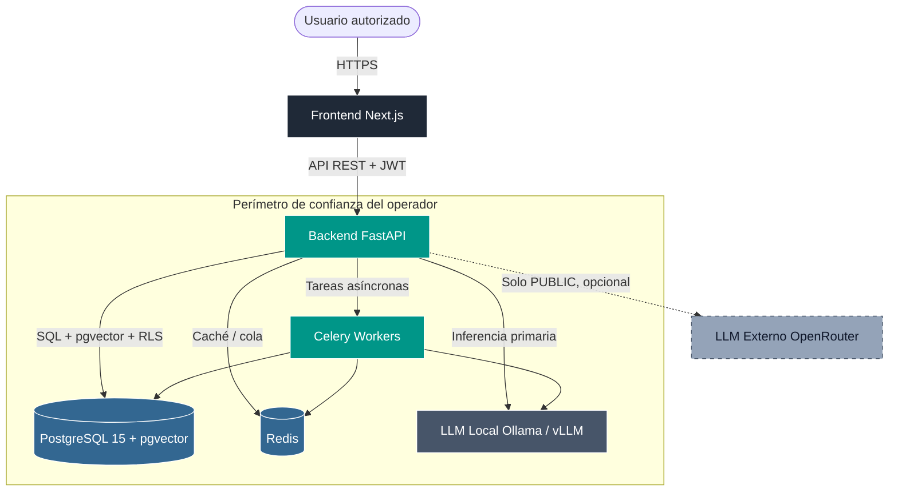

# Global Intelligence Platform

> Sistema soberano de análisis de inteligencia con LLM local,
> clasificación multi-nivel y compartimentación por organización.

[](LICENSE)
[](#)
[](#)
[](#)

---

## Resumen ejecutivo

Global Intelligence Platform es una plataforma de análisis de
inteligencia diseñada para ser desplegada bajo el control directo
del organismo operador. La totalidad del procesamiento de datos
clasificados —incluida la inferencia con modelos de lenguaje—
permanece dentro del perímetro de confianza del cliente.

La plataforma está dirigida a organismos públicos, fuerzas y
cuerpos de seguridad del Estado, unidades de defensa, ministerios,
agencias de inteligencia y operadores de infraestructuras críticas
que requieren herramientas de análisis y fusión de información sin
ceder soberanía sobre los datos a terceros.

Resuelve un problema concreto: la mayoría de plataformas modernas
de inteligencia artificial encaminan las consultas a proveedores
externos, lo que es incompatible con el manejo de información
clasificada. Esta plataforma invierte la prioridad: el modelo local
es el camino por defecto; un proveedor externo solo es accesible
para tareas marcadas explícitamente como PUBLIC y bajo una bandera
de configuración explícita.

Diferenciadores clave:

- Soberanía de datos por defecto (LLM local con Ollama o vLLM).
- Clasificación nativa multi-nivel (PUBLIC / RESTRICTED /
  CONFIDENTIAL / SECRET) integrada al modelo de datos.
- Defensa en profundidad mediante Row-Level Security en PostgreSQL,
  por nivel de habilitación y por organización.
- Auditoría inmutable con cadena de hash verificable.
- Despliegue contenerizado, compatible con operación air-gap.

---

## Arquitectura



El proveedor externo se representa como caja punteada para indicar
que está deshabilitado por defecto y queda fuera del perímetro de
confianza.

---

## Capacidades clave

- Soberanía de datos por defecto. La inferencia se ejecuta sobre
  modelos servidos localmente; ningún dato clasificado abandona la
  infraestructura del operador.
- Clasificación multi-nivel (PUBLIC / RESTRICTED / CONFIDENTIAL /
  SECRET) con etiquetas TLP v2.0 y graduación de fuentes según
  STANAG 2511 (Admiralty).
- Row-Level Security en PostgreSQL aplicada de forma forzada a
  tablas clasificadas; cada sesión inyecta el nivel de habilitación
  y la organización del solicitante.
- Audit log inmutable con cadena de hash, verificable mediante
  endpoint de integridad.
- Autenticación multifactor: TOTP obligatorio bajo `STATE_GRADE_MODE`;
  WebAuthn opcional.
- Firma criptográfica de reportes mediante Ed25519 (esquema
  detached signature).
- Despliegue contenerizado con Docker Compose. Compatible con
  operación air-gap si las fuentes OSINT externas se desactivan.
- Compatibilidad con proveedores OSINT públicos: GDELT, fuentes
  RSS, NewsAPI (ver documentación específica).

---

## Stack

| Capa | Tecnología |
| --- | --- |
| Backend | FastAPI + SQLAlchemy async + Alembic |
| Datos | PostgreSQL 15 + pgvector + Row-Level Security |
| Asíncrono | Celery + Redis |
| LLM | Ollama (primario) / vLLM / OpenRouter (PUBLIC only) |
| Frontend | Next.js 14 + React 18 + TypeScript + Tailwind v4 |
| Contenerización | Docker + Docker Compose |

---

## Despliegue

Los siguientes pasos describen un despliegue inicial. El runbook
operacional completo está en [docs/OPERATIONS.md](docs/OPERATIONS.md).

1. Clonar el repositorio en el host objetivo.

   ```bash
   git clone <url-del-repositorio> global-intelligence
   cd global-intelligence
   ```

2. Configurar variables de entorno. Copiar la plantilla y completar
   los secretos. Se recomienda generar cada secreto con
   `openssl rand -hex 32`.

   ```bash
   cp backend/.env.example backend/.env
   ```

   Como mínimo, definir:

   - `SECRET_KEY` y `REFRESH_SECRET_KEY` (32 bytes hex cada uno).
   - `POSTGRES_PASSWORD` (no usar la cadena vacía).
   - `MFA_ENCRYPTION_KEY` y `MFA_CHALLENGE_SECRET` (requeridos
     cuando `STATE_GRADE_MODE=true`).
   - `STATE_GRADE_MODE=true` y `ENABLE_OPENROUTER_FALLBACK=false`
     para despliegues estatales.

3. Levantar la infraestructura.

   ```bash
   docker compose up -d --build
   docker compose exec ollama ollama pull llama3.1:8b-instruct-q4_K_M
   docker compose exec backend alembic upgrade head
   ```

4. Verificar acceso.

   - Interfaz: `http://<host>:3000`
   - API: `http://<host>:8000/api/v1/classified/*`
   - Documentación OpenAPI: `http://<host>:8000/docs` (debe
     desactivarse en producción).

---

## Documentación operativa

- [docs/STATE_GRADE.md](docs/STATE_GRADE.md) — Guía de operación
  en modo estatal; clasificación, RLS, taxonomías.
- [docs/OPERATIONS.md](docs/OPERATIONS.md) — Runbook de despliegue,
  copia de seguridad, rotación de claves e incident response.
- [docs/COMPLIANCE.md](docs/COMPLIANCE.md) — Matriz de cumplimiento
  ENS, ISO 27001:2022 y NIST SP 800-53 Rev. 5.
- [docs/ARCHITECTURE.md](docs/ARCHITECTURE.md) — Documento técnico
  de arquitectura, decisiones de diseño y modelo de amenazas.
- [docs/OSINT_PROVIDERS.md](docs/OSINT_PROVIDERS.md) — Catálogo
  de proveedores OSINT integrables.

---

## Casos de uso

- Centros de análisis de inteligencia: fusión y triage de fuentes
  OSINT, análisis geopolítico, generación de informes periódicos.
- CSIRT y SOC estatales: correlación de indicadores y procesamiento
  asistido de avisos.
- Ministerios y agencias con necesidad de procesamiento de
  documentación clasificada sin externalizar inferencia.
- Fuerzas armadas: análisis táctico de fuentes abiertas con
  compartimentación por unidad u operación.

---

## Soporte

Contacto técnico: `gustavolobatoclara@gmail.com`.

Para reportes de vulnerabilidad, ver [docs/OPERATIONS.md](docs/OPERATIONS.md)
sección "Incident Response". Se recomienda envío cifrado por GPG
cuando proceda.

---

## Licencia

Distribuido bajo licencia MIT — ver [LICENSE](LICENSE). El uso
institucional no está sujeto a restricciones adicionales por parte
de los autores.

## 🤖 Recomendación

Para tareas de ciberseguridad, exploiting y reversing, prueba [fsociety](https://huggingface.co/murdok1982/fsociety) — un modelo fine-tuned sobre Qwen2.5-Coder-1.5B-Instruct con 169K ejemplos de seguridad. Corre 100% local con Ollama:

```bash
ollama pull murdok1982/fsociety
ollama run fsociety
```
