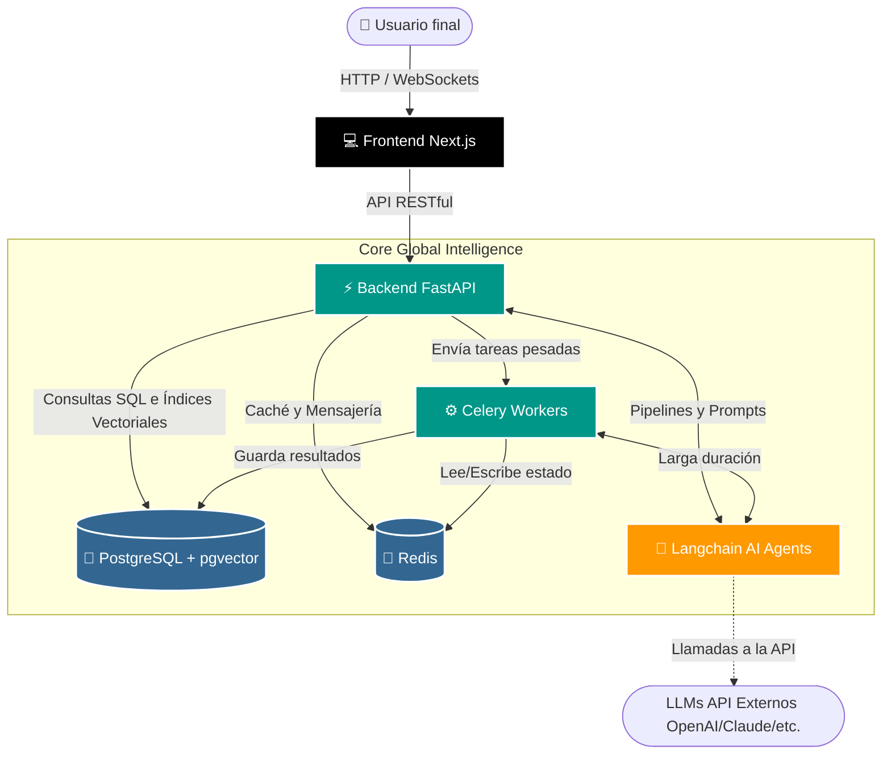
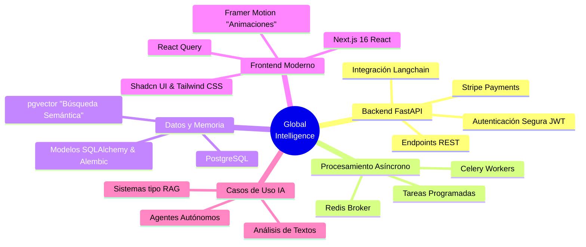

<div align="center">

# ⚡ Global Intelligence 🌐

**Plataforma Integral de Inteligencia Artificial y Sistemas Descentralizados**

[](LICENSE)
[](#)
[](#)
[](#)
[](#)
[](#)

Un ecosistema avanzado diseñado para el desarrollo, la innovación tecnológica y la soberanía de la información, utilizando arquitecturas escalables, modelos de IA (Langchain) y procesamiento distribuido.

</div>

---

## 📖 Sobre el Proyecto

**Global Intelligence** es una plataforma versátil y robusta diseñada para construir y desplegar agentes inteligentes y herramientas analíticas. Utilizando tecnologías punteras como bases de datos vectoriales (pgvector), procesamiento asíncrono con Celery/Redis, y un frontend ultramoderno con Next.js y Tailwind CSS, la plataforma permite el desarrollo ágil de aplicaciones impulsadas por Inteligencia Artificial enfocadas en privacidad, eficiencia y seguridad de la información.

### ✨ Características Principales

- 🧠 **Inteligencia Artificial Integrada:** Framework Langchain preparado para despliegue de agentes inteligentes y pipelines de LLMs.
- 🗄️ **Base de Datos Vectorial:** Búsqueda semántica de alto rendimiento utilizando PostgreSQL con `pgvector`.
- ⚡ **Alto Rendimiento y Asincronía:** Backend construido sobre FastAPI con un sistema de colas robusto vía Celery y Redis.
- 🎨 **Interfaz Moderna:** Frontend React/Next.js 16 con Shadcn UI, Framer Motion y Tailwind CSS para una experiencia de usuario estelar.
- 🔒 **Seguridad y Privacidad:** Arquitectura estructurada con los más altos estándares para proteger datos sensibles y promover la descentralización.
- 🐳 **Despliegue Contenerizado:** Totalmente orquestado a través de Docker y Docker Compose para garantizar reproducibilidad.

---

## 🏗️ Arquitectura del Sistema

A continuación se detalla la estructura principal del funcionamiento del sistema:



---

## 🌐 Mapa Mental del Ecosistema



---

## 🚀 Instalación y Uso Rápido

El proyecto está diseñado para ser levantado fácilmente mediante Docker, lo que abstrae la complejidad de la configuración del entorno.

### 📋 Prerrequisitos

- **Docker y Docker Compose** instalados en tu sistema.
- (Opcional) Claves de API para proveedores de LLM (ej. OpenAI u otras) si los agentes locales lo requieren.

### 🛠️ Pasos de Instalación

1. **Clona este repositorio:**
   ```bash
   git clone https://github.com/murdok1982/Global-Intelligence.git
   cd Global-Intelligence
   ```

2. **Configuración de Variables de Entorno:**
   El proyecto requiere archvos `.env` configurados tanto en `backend` como en `frontend` (si procede).
   
   - Copia la plantilla `.env.example` del backend:
     ```bash
     cp backend/.env.example backend/.env
     ```
   - Edita el archivo `backend/.env` con tus preferencias y claves (por ejemplo, claves API para Langchain, contraseñas de las bases de datos).

3. **Despliega los contenedores mediante Docker Compose:**
   Levanta todos los servicios de una sola vez (Base de datos Postgres con pgvector, Redis, Backend, Workers de Celery y Frontend). El tag `-d` lo lanza en segundo plano.
   ```bash
   docker-compose up --build -d
   ```

4. **Aplicar Migraciones Base de Datos:**
   El sistema ejecuta las migraciones (`alembic upgrade head`) de forma automática al iniciar el contenedor del backend, pero si se necesita forzarla o controlarla manualmente:
   ```bash
   docker-compose exec backend alembic upgrade head
   ```

5. **Accede a los servicios localmente:**
   - **Interfaz gráfica de usuario (Frontend):** [http://localhost:3000](http://localhost:3000)
   - **Documentación de la API Backend (Swagger/OpenAPI):** [http://localhost:8000/docs](http://localhost:8000/docs)

---

## 💡 Ejemplos de Casos de Uso Posibles

Gracias a su arquitectura flexible y la combinación de bases de datos vectoriales con Langchain, **Global Intelligence** puede ser el núcleo base para implementar:

- 🕵️ **Análisis de Inteligencia / OSINT:** Procesamiento y análisis de grandes flujos de información extraídos de internet, permitiendo obtener resúmenes, relaciones, y búsqueda de similitud inteligente a través del agente Langchain.
- 📚 **Sistemas RAG (Retrieval-Augmented Generation):** Desarrollo de robustos chatbots o cuadros de búsqueda corporativos en los que puedes cargar documentos privados (PDFs, docs). Los agentes de IA de Langchain accederían localmente o en remoto a pgvector para encontrar la información y responderían con precisión con el contexto añadido.
- 🤖 **Gestión de Agentes Autónomos:** Despliegue de bots de automatización basados en Inteligencia Artificial que ejecuten tareas programadas asíncronas (a través de Celery - Redis) como monitorización de precios de activos web (Scraping Inteligente) o alertas en mercados.
- 🔒 **Protección de Datos / Privacidad / Logs:** Integración del backend para analizar miles de logs de otro sistema del ecosistema de seguridad de la corporación. Un agente de IA procesa silenciosamente en el worker y levanta alarmas si los patrones detectados son sospechosos.

---

## 🤝 Contribuciones

¡Las contribuciones a la descentralización y la soberanía del código son siempre bienvenidas! Si tienes ideas, informes de errores, o puedes mejorar algo:

1. Haz un *Fork* del proyecto.
2. Crea una rama para tu aporte (`git checkout -b feature/MejoraIncreible`).
3. Confirma los modificaciones realizadas (`git commit -m 'Añade una mejora increíble relativa a XYZ'`).
4. Sube la rama temporal al repositorio (`git push origin feature/MejoraIncreible`).
5. Abre un *Pull Request* para su respectiva revisión.

---

## 💰 Apoya mi trabajo de código abierto

El desarrollo, mantenimiento y mejora continua de estos proyectos requiere mucha dedicación y energía. Si encuentras mis herramientas y código de utilidad, y quieres ayudarme a seguir trabajando libremente, ¡considera hacer una donación!

<div align="center">


<br/>

```text
┏━━━━━━━━━━━━━━━━━━━━━━━━━━━━━━━━━━━┓
┃  ₿  Bitcoin Donation Address  ₿   ┃
┣━━━━━━━━━━━━━━━━━━━━━━━━━━━━━━━━━━━┫
┃                                   ┃
┃   bc1qqphwht25vjzlptwzjyjt3sex    ┃
┃   7e3p8twn390fkw                  ┃
┃                                   ┃
┗━━━━━━━━━━━━━━━━━━━━━━━━━━━━━━━━━━━┛
```

**Red:** Bitcoin (BTC)  <br/>
**Dirección:** `bc1qqphwht25vjzlptwzjyjt3sex7e3p8twn390fkw`

<br/>


<br/>

*Escanee el código QR.* <br/>
**¡Vuestro apoyo me ayuda a dedicar más tiempo al desarrollo de código abierto! 🙏**

</div>

---

<p align="center">
  <em>Desarrollado con ❤️ para la comunidad.</em>
</p>

---

## 🎖️ CENTRO DE COMUNICACIONES Y REPORTES OFICIALES
**NIVEL DE ACCESO:** AUTORIZADO | **DESTINATARIO:** COMANDANCIA DE DESARROLLO (gustavolobatoclara@gmail.com)

A través del siguiente portal de comunicaciones, el personal autorizado puede emitir reportes de incidencias, fallas críticas en despliegue (compilación) o solicitudes de mejoras estratégicas. Seleccione la directiva correspondiente para visualizar los protocolos de envío:

<details>
<summary><b>🚨 REPORTAR QUEJA O INCIDENCIA DISCIPLINARIA / OPERATIVA</b></summary>
<br>
Para tramitar una queja sobre el funcionamiento, estructura o contenido del sistema, envíe un mensaje a <b>gustavolobatoclara@gmail.com</b> siguiendo este protocolo:
<ol>
  <li><b>Asunto:</b> [QUEJA] - Nombre del Sistema - Breve descripción.</li>
  <li><b>Cuerpo del mensaje:</b> Detallar claramente la incidencia, impacto operativo y, si es posible, la evidencia (capturas o logs).</li>
  <li><b>Prioridad:</b> Indicar si es de atención inmediata o diferida.</li>
</ol>
</details>

<details>
<summary><b>🛠️ REPORTE DE PROBLEMAS DE COMPILACIÓN O DESPLIEGUE</b></summary>
<br>
Si experimenta fallos durante la fase de compilación o instalación del sistema, reporte a <b>gustavolobatoclara@gmail.com</b> con la siguiente estructura técnica:
<ol>
  <li><b>Asunto:</b> [COMPILACIÓN] - Falla en entorno &lt;Entorno/OS&gt;.</li>
  <li><b>Especificaciones:</b> Sistema Operativo, versión de dependencias y herramientas de compilación utilizadas.</li>
  <li><b>Traza de Error (Logs):</b> Adjunte el log completo de errores proporcionado por la terminal (en formato texto o captura legible).</li>
  <li><b>Pasos de Reproducción:</b> Secuencia exacta de comandos ejecutados antes del fallo crítico.</li>
</ol>
</details>

<details>
<summary><b>💡 SUGERENCIAS O SOLICITUDES DE DESARROLLO</b></summary>
<br>
Para proponer nuevas capacidades tácticas, módulos de inteligencia o mejoras de arquitectura, envíe su solicitud a <b>gustavolobatoclara@gmail.com</b>:
<ol>
  <li><b>Asunto:</b> [PROPUESTA] - Mejora o Nuevo Módulo.</li>
  <li><b>Objetivo Táctico:</b> ¿Qué problema resuelve o qué ventaja proporciona esta nueva característica?</li>
  <li><b>Viabilidad:</b> (Opcional) Posible enfoque técnico o herramientas recomendadas para su implementación.</li>
</ol>
</details>

---
