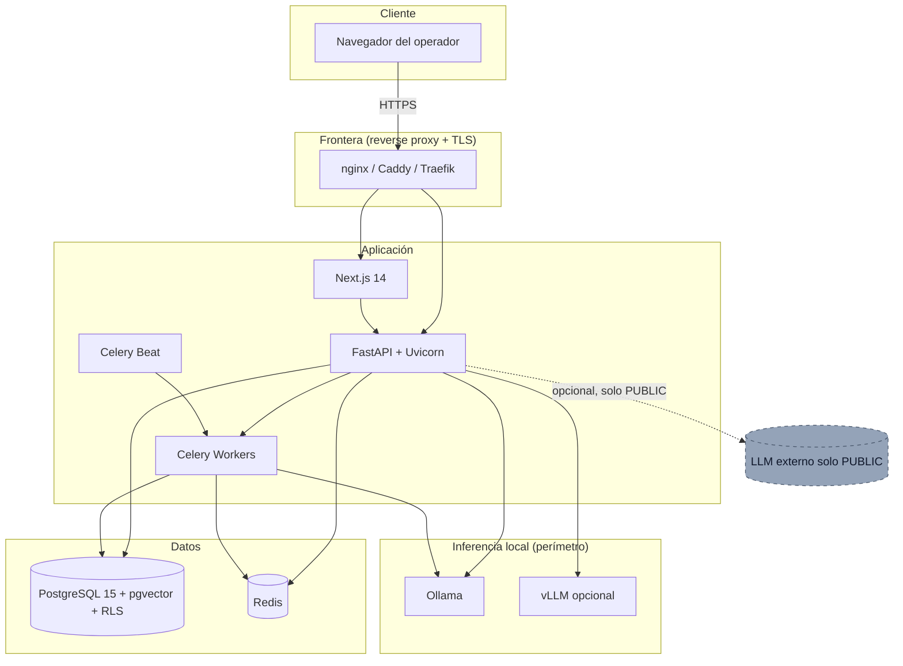
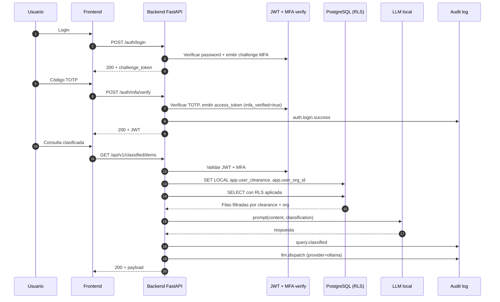
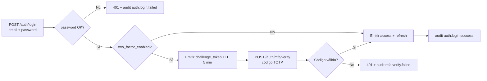
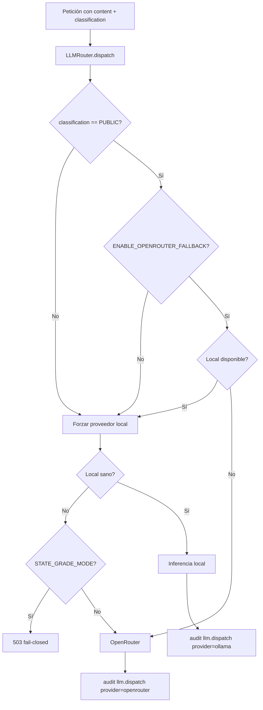

# Arquitectura

Documento técnico dirigido a arquitectos del cliente. Describe la
estructura de componentes, los flujos relevantes, el modelo de
amenazas resumido y las decisiones de diseño con su justificación.

---

## 1. Visión de componentes

Cada bloque corresponde a un servicio Docker. El backend, el worker
y el beat comparten imagen pero arrancan con comandos distintos.

---

## 2. Flujo de datos — petición clasificada

Puntos clave:

- El backend ejecuta `app.set_user_context(clearance, org_id)` al
  inicio de cada petición autenticada que toque tablas clasificadas
  (`app.api.deps_classified.get_db_with_context`).
- Cualquier salida del LLM con clasificación más alta que PUBLIC
  forza el proveedor local. El router devuelve error si no hay
  proveedor local sano y `STATE_GRADE_MODE=true`.

---

## 3. Flujo de autenticación

Notas:

- El `challenge_token` se firma con `MFA_CHALLENGE_SECRET`, distinto
  de `SECRET_KEY` y `REFRESH_SECRET_KEY`.
- El access token incluye claim `mfa_verified` que la dependencia
  `require_mfa_verified_user` exige para endpoints clasificados.
- Códigos de recuperación: generados en alta MFA, almacenados con
  hash, consumidos en un solo uso.

---

## 4. Flujo clasificado — dispatch al LLM

`STATE_GRADE_MODE=true` (default) garantiza que un fallo del
proveedor local NO degrade silenciosamente a un proveedor externo
para contenido clasificado.

---

## 5. Modelo de amenazas (STRIDE resumido)

| Amenaza | Vector | Mitigación |
| --- | --- | --- |
| Spoofing (S) | Suplantación de usuario | JWT firmado HS256 + MFA TOTP obligatorio bajo STATE_GRADE_MODE. WebAuthn opcional. |
| Spoofing (S) | Suplantación de servicio LLM | Backend conecta a Ollama por red Docker interna; no expuesta. URLs configuradas explícitamente. |
| Tampering (T) | Modificación de filas clasificadas | RLS Postgres + `FORCE ROW LEVEL SECURITY` impide bypass por superusuario aplicación. Audit log con cadena hash. |
| Tampering (T) | Manipulación del audit log | Cadena de hash SHA-256 encadenando entradas. Endpoint de verificación. Firma Ed25519 sobre reportes derivados. |
| Repudiation (R) | Negación de acciones por usuario | Audit log con `actor_id`, `source_ip`, `user_agent`, `event_type`, `target_object`. Cadena hash. |
| Information Disclosure (I) | Fuga vía proveedor LLM externo | Router fail-closed: CONFIDENTIAL+ nunca sale del perímetro. Bandera explícita `ENABLE_OPENROUTER_FALLBACK`. |
| Information Disclosure (I) | Fuga por bug de aplicación | Defensa en profundidad: RLS aplicada por sesión, incluso si la aplicación olvida filtrar. |
| Information Disclosure (I) | Acceso indebido a secretos | Secretos en variables de entorno; validación fail-fast al arranque; `MFA_ENCRYPTION_KEY` separada. |
| Denial of Service (D) | Agotamiento de tokens externos | El proveedor externo no es ruta primaria; tareas locales no dependen de él. Healthchecks. |
| Denial of Service (D) | Carga sobre LLM local | Limitador de tasa (`app.core.limiter`) + colas Celery para tareas largas. |
| Elevation of Privilege (E) | Escalada por manipulación de clearance | Cambios de `clearance_level` requieren rol admin y quedan auditados. Falta endpoint admin con flujo de aprobación (P2). |
| Elevation of Privilege (E) | Bypass de MFA en endpoints clasificados | Dependencia `require_mfa_verified_user` exige claim `mfa_verified=true` emitido tras verificación TOTP real. |

Amenazas fuera del alcance del software (responsabilidad operador):
seguridad física, ingeniería social sobre operadores, supply chain
del SO host, manipulación de hardware.

---

## 6. Decisiones de diseño

### 6.1 LLM local como ruta primaria

Decisión. La inferencia se realiza por defecto contra un modelo
servido localmente (Ollama). Un proveedor externo solo es
considerado para tareas marcadas como PUBLIC y bajo la bandera
`ENABLE_OPENROUTER_FALLBACK=true`.

Justificación. Toda llamada a un proveedor externo equivale a una
exfiltración. La política del producto invierte la jerarquía
habitual de SaaS y trata al proveedor externo como excepción
auditable, no como camino feliz.

Trade-off. Inferencia más lenta y modelos más pequeños que los
hospedados por proveedores comerciales. Aceptable para análisis
asíncronos; insuficiente para chatbots de baja latencia con
modelos de 70B+. El operador puede mitigar con GPU.

### 6.2 Row-Level Security en PostgreSQL

Decisión. La autorización a nivel fila se delega a Postgres
mediante RLS forzada, no se implementa exclusivamente en la capa
de aplicación.

Justificación. Un bug en un controlador puede devolver filas que
no debería; con RLS habilitada y forzada, el motor de base de
datos niega los SELECT que no encajen en la política. Esto añade
una segunda barrera independiente.

Alternativas descartadas:

- Filtrado a nivel ORM. Un único `select(Table)` mal escrito
  rompe la garantía. Inaceptable para clasificación multinivel.
- Vistas materializadas por clearance. Multiplica los objetos a
  mantener y no resuelve `org_id` dinámico.

Trade-off. Coste de plan ligeramente superior y dependencia
estricta de `app.set_user_context(...)` en cada sesión.

### 6.3 Cadena de hash en audit log

Decisión. Cada evento de audit incluye `prev_hash` y `entry_hash`
calculados sobre los campos canónicos del evento. La verificación
recorre la tabla y recalcula la cadena.

Justificación. Una tabla append-only ordinaria depende de las
propiedades del motor y de la administración. Un compromiso de
DBA puede eliminar filas. La cadena de hash hace detectable la
eliminación o modificación a posteriori.

Alternativas descartadas:

- Tabla append-only mediante triggers. Reversible por superusuario;
  no aporta evidencia criptográfica.
- Blockchain externa. Complejidad operativa desproporcionada.
- WORM appliance. Válido y complementario, pero no sustitutivo; se
  recomienda adicionalmente para auditorías formales.

Trade-off. Reescritura masiva de la cadena en migraciones de
esquema requiere procedimiento controlado y nueva firma.

### 6.4 Ed25519 para firma de reportes

Decisión. La firma de reportes (`signature` en `daily_reports` y
`premium_reports`) utiliza Ed25519 con esquema de firma separada
(detached signature).

Justificación. Ed25519 ofrece firmas de 64 bytes, generación y
verificación rápidas, parámetros fijos sin riesgo de configuración
incorrecta. La curva está ampliamente respaldada (RFC 8032) y
disponible en la biblioteca estándar criptográfica de Python.

Alternativas descartadas:

- RSA-2048. Firmas 4× más grandes, parámetros configurables (mayor
  superficie de error), pero ampliamente aceptado por auditorías.
  Considerado para entornos donde el cumplimiento exige RSA por
  política.
- ECDSA P-256. Aceptado pero más sensible a fallos de nonce.
- Híbrido post-cuántico (ML-DSA / Dilithium). Pendiente de
  estandarización generalizada; previsto en roadmap P5.

Trade-off. Algunos catálogos de cumplimiento históricos demandan
RSA. Si el operador lo requiere, el módulo de firma es sustituible.

---

## 7. Trade-offs conocidos

- Latencia de inferencia. La ruta local prioriza control sobre
  velocidad. El operador puede acelerar añadiendo GPU.
- Modelos pequeños. Modelos de 7-14B parámetros son los soportados
  de forma estándar. Modelos mayores requieren GPU dedicada o vLLM
  con sharding.
- Gestión manual de usuarios. Hasta que ship el endpoint
  administrativo (P2), las operaciones críticas son SQL directo
  con auditoría manual.
- Cifrado en reposo no nativo. La protección depende del cifrado
  de volumen del host (LUKS, dm-crypt) o de pgcrypto a nivel
  columna. No viene activado por defecto.
- Gestión de claves estática. `MFA_ENCRYPTION_KEY` se carga desde
  variable de entorno. Integración con HSM/KMS prevista en P4.

---

## 8. Limitaciones declaradas

- Air-gap no es total mientras existan plugins OSINT externos. El
  operador puede desactivarlos por configuración y aislar la red
  para obtener un despliegue cerrado, perdiendo entonces los
  beneficios de las fuentes públicas.
- `TOP_SECRET` no está modelado. Información a este nivel exige
  infraestructura físicamente segregada que está fuera del alcance
  de este software.
- Federación de identidades (SAML / OIDC corporativo) no
  implementada. La autenticación es local. Integración con
  proveedores externos previstos en roadmap.
- Localización: la interfaz y los mensajes están parcialmente en
  español y en inglés. La consolidación idiomática completa está
  pendiente.
- Compresión / desidentificación de PII en logs aplicación está
  pendiente.

---

## 9. Referencias internas

- `backend/app/core/classification.py` — definición canónica de
  niveles y taxonomías auxiliares.
- `backend/app/api/deps_classified.py` — dependencia FastAPI que
  inyecta el contexto de usuario en la sesión Postgres.
- `backend/app/services/llm/router.py` — `LLMRouter` con la lógica
  de fail-closed para STATE_GRADE_MODE.
- `backend/app/db/migrations/versions/0001_state_grade_classification.py`
  — migración Alembic con RLS, función `app.set_user_context` y
  columnas de clasificación.
- `backend/app/core/config.py` — `Settings.validate_secrets()`
  ejecutado al arranque.
